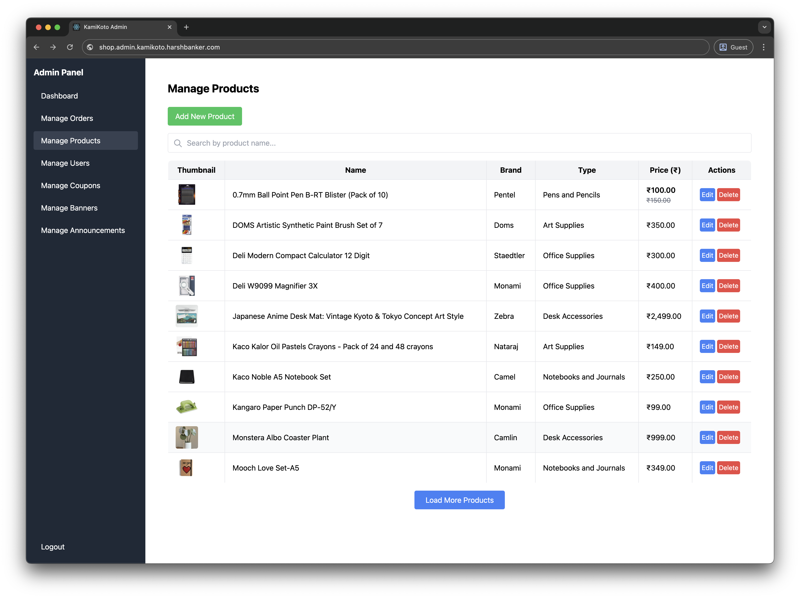
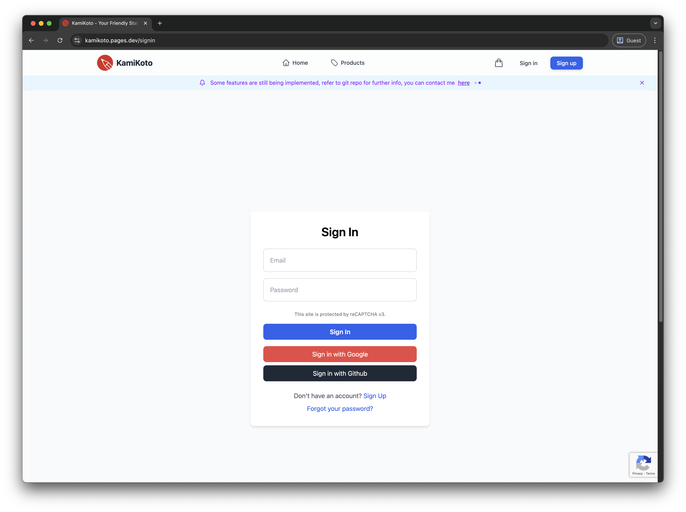

# Admin Side (Separate Repo: [shopAdmin](https://github.com/itfeelsharsh/shopAdmin)):
 (made with React + Firebase no server deployment required, can-be hosted on CloudFlare pages, Vercel, Netlify, Firebase Hosting Etc.)

# KamiKoto - Stationery E-Commerce Web App

Welcome to KamiKoto, a beautifully crafted e-commerce platform offering a seamless shopping experience for stationery. This project is built using **React.js** and **Firebase**, delivering a delightful UI/UX and mobile-friendly experience for all users.

## 📸 Screenshots

<div align="center">
  
  
  
  
  
  
  
  
  
  
  
</div>

**Live Demo:** [kamikoto.pages.dev](https://kamikoto.pages.dev)

---

## 🌟 Features

### User Side:

- **Sign In / Sign Up:** Create a new account or log in using email/password.
- **Google / GitHub Authentication:** Sign in quickly using Google or GitHub accounts.
- **Password Reset:** Securely reset forgotten passwords.
- **User Profile Setup:** Update personal information (Profile Picture, Email, Phone, Address).
- **Cart System & Payment Handling:** Add products to the cart and securely process payments.
- **Shipping Details:** Enter shipping information for delivery.
- **Mobile Friendly:** Responsive design for a smooth shopping experience across all devices.

### Admin Side (Separate Repo: [shopAdmin](https://github.com/itfeelsharsh/shopAdmin)):

- **Manage Users:** View user details (Profile Picture, Contact Info), ban users if necessary.
- **Manage Products:** Add, edit, or delete products with detailed information such as:
  - Product Name
  - Description
  - Price (₹)
  - Brand, Stock, and Product Type
  - Primary, Secondary, Tertiary Image URLs
  - Option to feature the product on the homepage

---

## 🚀 Getting Started

### Setup & Installation

1. **Clone the Repository**

   ```bash
   git clone https://github.com/itfeelsharsh/kamikoto.git
   cd kamikoto
   ```

2. **Install Dependencies**

   ```bash
   npm install
   ```

3. **Start the Development Server**

   ```bash
   npm start
   ```

4. **Firebase Configuration:**
   - Add your Firebase project configuration in `firebase.js`.
   - Set up Firestore Database and Authentication in [Firebase Console](https://console.firebase.google.com).
   - Update Firestore security rules accordingly.

5. **Email Configuration with Resend:**
   - Create a `.env` file in the root directory based on the example below.
   - Sign up at [Resend](https://resend.com) to get your API key.
   - Verify your domain in Resend dashboard for better deliverability.
   - Email functionality is enabled by default unless specifically disabled.
   - Add your Resend API key to the Cloudflare Pages environment variables as `RESEND_API_KEY`.
   - Customize your email addresses as needed.

   ```
   # Email Configuration
   # Email is enabled by default unless set to 'false'
   # REACT_APP_EMAIL_ENABLED=false
   
   REACT_APP_EMAIL_FROM=orders@yourdomain.com
   REACT_APP_SUPPORT_EMAIL=support@yourdomain.com
   ```

   The application uses Cloudflare Functions to handle email sending server-side, avoiding CORS issues. When deployed to Cloudflare Pages:
   
   1. Add the `RESEND_API_KEY` environment variable in the Cloudflare Pages dashboard.
   2. The Functions directory contains the server-side code that handles secure API calls to Resend.
   3. Emails are sent through a secure server-side function rather than directly from the browser.

   The application will automatically send order confirmation emails when orders are placed, and shipping notification emails when orders are shipped.

---

## 🛠 Firebase Firestore Configuration

Set up Firebase Firestore by following these steps:

1.  Go to [Firebase Console](https://console.firebase.google.com) and enable **Firestore** and **Authentication**.

2.  Set Firestore rules for secure data access:
    - Go to Firestore Console and click on `Rules` tab.
    - Copy the rules from `firestore.rules.txt` file and paste it in the rules editor.
    - Click on `Publish` button to publish the rules.

3.  For **Admin Panel Access**, go to Firestore and add the following field to any user you want to give admin rights:

    ```plaintext
    userRole : Admin
    ```

---

## ⚡️ Admin Panel Access

To use the Admin Panel ([shopAdmin](https://github.com/itfeelsharsh/shopAdmin)):

1. Register as a normal user.
2. In the Firestore Console, find the user in the `users` collection and update their role:

   ```plaintext
   userRole : Admin (string)
   ```

3. The user can now access the admin dashboard to manage products and users.

---

## 📝 Notes

- **Optimized UI/UX:** The application uses clean, modern design principles for a smooth user experience, modeled after Apple's elegant design ethos.
- **Mobile-Friendly:** Built with responsive design to ensure users have a great experience on both desktop and mobile devices.
- **Secure Authentication:** Firebase Authentication provides seamless sign-in options, including Google and GitHub for faster logins.
- **Easy Product Management:** Admins can quickly add, edit, or remove products with all the necessary details, including images, stock, and pricing.
- **Performance-Oriented:** Leveraging Firebase Firestore for fast data access and real-time updates.
- **Great for E-Commerce Projects:** The codebase is structured to be scalable and can be extended for various other e-commerce needs.

---

## 🧑‍💻 Tech Stack

- **Frontend:** React.js
- **Backend/Database:** Firebase (Firestore, Authentication)
- **Email Service:** Resend API with Cloudflare Functions
- **Deployment:** Cloudflare Pages with Functions